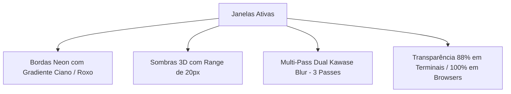

# 🎨 Theming Dinâmico, Glassmorphism & Wallpapers Animados

Este documento descreve o motor de temas do Omarchy, os efeitos visuais de vidro fosco (Glassmorphism) no Hyprland e o sistema de papel de parede animado com aceleração por hardware.

---

## 🌈 Omarchy Theme Engine (19 Temas Integrados)

O sistema possui 19 paletas completas (*Catppuccin, Tokyo Night, Gruvbox, Kanagawa, Nord, Rose Pine, Everforest, etc.*). A troca de temas propaga instantaneamente para Hyprland, Waybar, Mako, Walker, Ghostty e Neovim.

### Comandos de Tema:
```bash
# Listar temas disponíveis:
omarchy-theme-list

# Trocar de tema pelo terminal:
omarchy-theme-set Gruvbox
omarchy-theme-set "Tokyo Night"
omarchy-theme-set Catppuccin

# Trocar pelo menu visual:
# Pressione Super + Alt + Espaço -> selecione "Theme"
```

---

## 🪟 Hyprland Glassmorphism (Efeito Vidro Fosco & Glow)

Configurado em [`arch-omarchy/.config/hypr/fivves_style.conf`](../arch-omarchy/.config/hypr/fivves_style.conf):



### Características Principais:
1. **Blur Seletivo Inteligente**:
   - **Terminais e Editores** (Ghostty, Alacritty, Kitty): 88% de opacidade com blur profundo.
   - **Navegadores e Players de Vídeo** (Chrome, YouTube, Zen): 100% opacos para leitura e consumo de mídia perfeitos.
2. **Bordas com Gradiente Glow**: Janela em foco destacada com gradiente animado (`rgba(33ccffee) rgba(bb86fcee)`).
3. **Animações Fluidas**: Curva elástica de amortecimento suave (`popin 85%`).
4. **Regras de Camada (Sintaxe Hyprland 0.56)**:
   ```conf
   layerrule = blur on, match:namespace waybar
   layerrule = blur on, match:namespace walker
   layerrule = blur on, match:namespace swayosd
   layerrule = blur on, match:namespace notifications
   ```

---

## ⛩️ Wallpaper Animado 4K/1080p com Zero-Overhead

O papel de parede animado é gerenciado pelo utilitário [`scripts/set-animated-wallpaper.sh`](../scripts/set-animated-wallpaper.sh) usando **`mpvpaper`**:

### Otimizações Térmicas e de GPU:
1. **Resolução 1080p Nativa**: O vídeo do Samurai foi transcodificado para `1920x1080 @ 30fps` (`~/.config/hypr/wallpapers/samurai_1080p.mp4`), eliminando o custo de downscaling da GPU.
2. **Auto-Pause Inteligente (`-p`)**: Sempre que janelas cobrirem a área de trabalho, a reprodução pausa automaticamente (**0% CPU e 0% GPU** enquanto você trabalha).
3. **Decodificação por Hardware**: Renderizado via `Vulkan` pela placa de vídeo sem esquentar o processador.
4. **Inicialização no Boot**: Registrado em [`arch-omarchy/.config/hypr/autostart.conf`](../arch-omarchy/.config/hypr/autostart.conf).

---

## 🔍 Walker Launcher & Clipboard (`Super + Espaço`)

O **Walker** ([`arch-omarchy/.config/walker/config.toml`](../arch-omarchy/.config/walker/config.toml)) é o inicializador rápido do sistema:
* **`Super + Espaço`** $\rightarrow$ Abre o menu de busca.
* `$` $\rightarrow$ **Histórico da Área de Transferência (Clipboard)**.
* `:` $\rightarrow$ Busca de **Emojis e Símbolos**.
* `=` $\rightarrow$ **Calculadora instantânea** (ex.: `= 150 * 1.2`).
* `.` $\rightarrow$ Busca de **Arquivos locais**.
* `@` $\rightarrow$ Busca na **Web**.

---

## 🖱️ Cursor & OSD
* **Cursor**: **Bibata Modern Classic** configurado em [`arch-omarchy/.config/hypr/envs.conf`](../arch-omarchy/.config/hypr/envs.conf) e [`~/.icons/default/index.theme`](~/.icons/default/index.theme).
* **SwayOSD**: Notificação visual na tela com cantos arredondados de 12px ao ajustar volume e brilho ([`arch-omarchy/.config/swayosd/`](../arch-omarchy/.config/swayosd/)).
